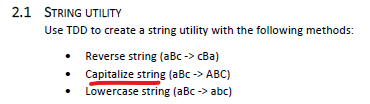
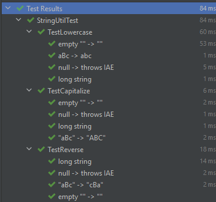

# Rùni's solutions for part 2

## 2.1 String Utility
> _Use TDD to create a string utility with the following methods: Reverse, Capitalize, Lowecase._
> 
> _Don’t use any built-in string utility – create your own. Remember, the exercise here is to use TDD, not to deliver a working utility without tests._

The text mentions to "capitalize" which is making Every Word Of The Sentence Start With A Big Letter.  
But the example converts the word to UPPERCASE.  

I chose to make my converter UPPERCASE on that basis.

For capitalize (uppercase) and lowercase I chose to only include a-z for simplicity.

Additional string testing that could have been done:
- add support beyond a-zA-Z and test
- Test unicode
- Test emojis
- Test surrogate pairs (https://stackoverflow.com/questions/5903008/what-is-a-surrogate-pair-in-java)

### Results

## 2.2 Bowling Game Kata
> Complete the Bowling Game Kata using TDD.
> The slides can be found here: http://butunclebob.com/files/downloads/Bowling%20Game%20Kata.ppt (Also in repo root)
